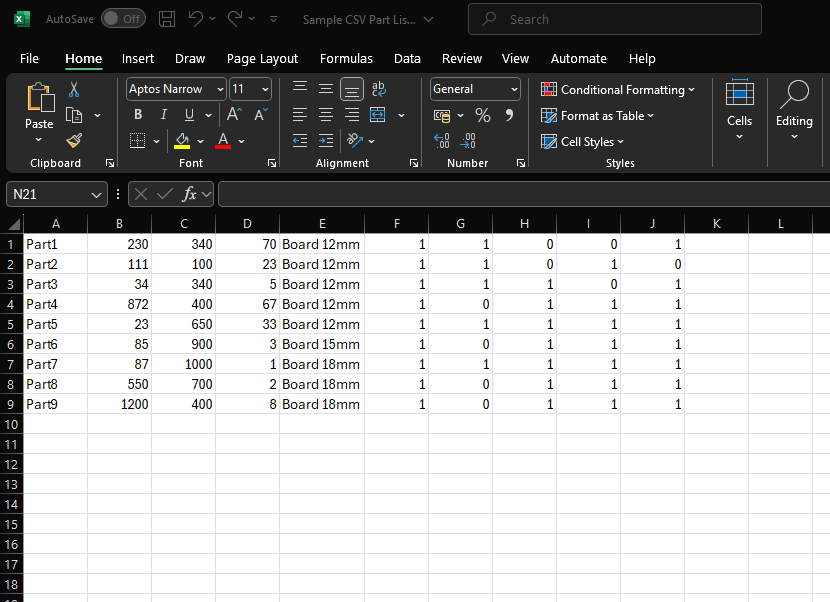
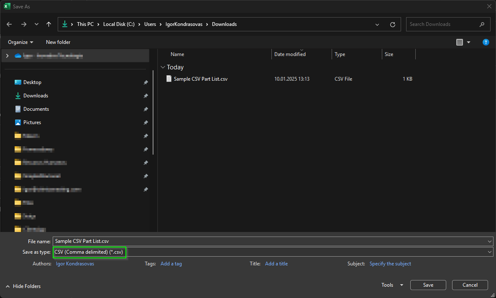
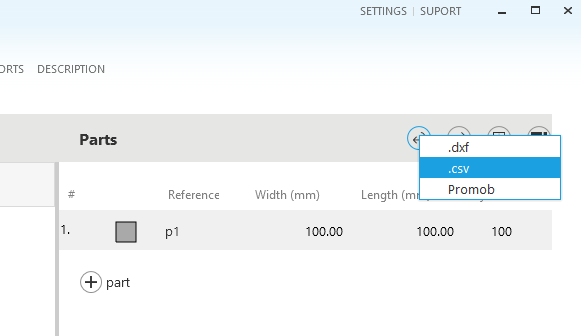
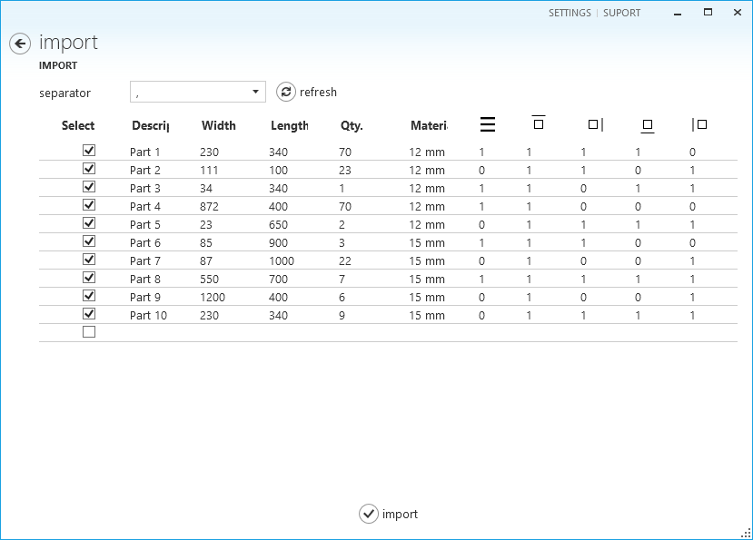
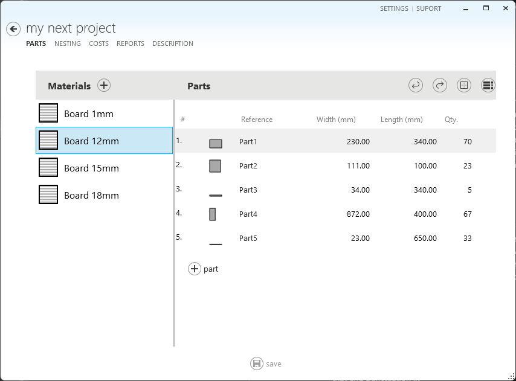
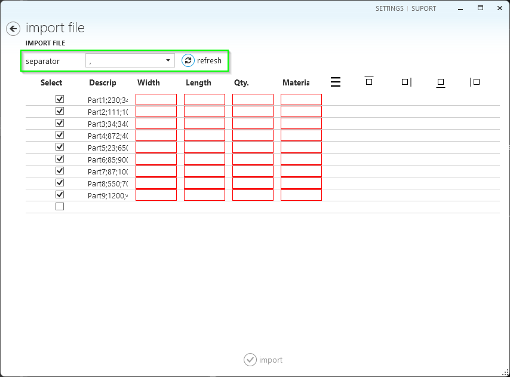
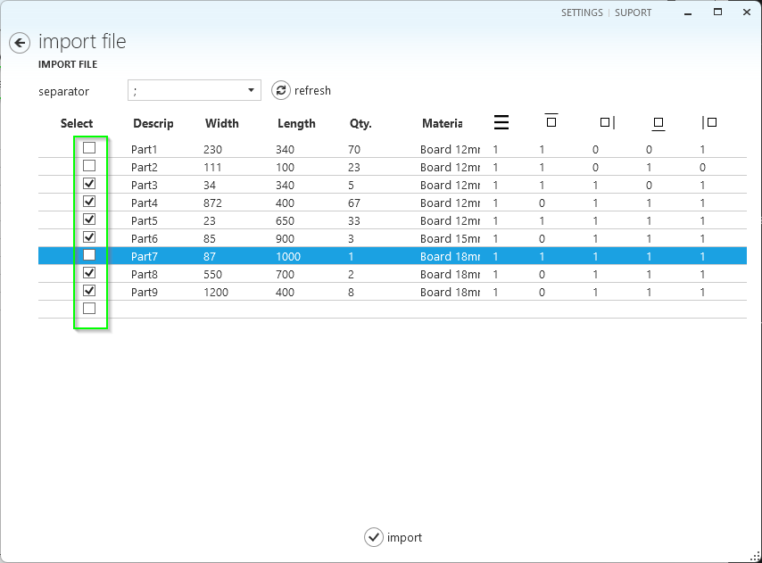

# Importing a Part List from Excel
Otimize Nesting is a productivity software, first and foremost. It includes the features you need for highly productive part nesting creation.

If there is a feature common to all productivity applications, it is the ability to read data from spreadsheets. These spreadsheets are usually manually created, for example, in Microsoft Excel or automatically created by another software program.

This topic helps you save time while importing rectangular part lists.

> [!NOTE]
> Special CAD or ERP systems can create digital files with part lists to improve system integration. If these files have the correct column configuration, they can be imported into Otimize Nesting.

Importing your existing part list into Otimize Nesting involves two main steps: preparing the file and importing it using Otimize Nesting.

## Part 1: Prepare the Part List File
Prepare a spreadsheet containing the list of parts you want to produce. Otimize Nesting expects a given spreadsheet column position for each part information. The following image shows a sample part list.

The columns are as follows:

**Description**: This is the file's first column, containing the textual description of the part that must be produced. The nesting diagrams over the part's area will display this text.

**Width**: Represents the width of the part to be produced. The length unit (millimeters, centimeters, inches) must match the one you selected in the software configuration.

**Length**: The same applies to the width column here.

**Quantity**: Represents the number of identical parts that will be produced.

**Material**: This represents the name of the raw material from which this part will be produced. During import, Otimize Nesting checks if this material already exists on the material list. If not, a new material record with a default board size will be added.

> [!Note]
> If the material is already registered, its settings will not be updated. After completing the import, check that the board dimensions and grain options are correct.

> [!Note]
> The default sheet size is the size entered by the user when creating the last material record. You can modify this value after import.

**Directonal Grain**: Indicates if this material has a special finishing or grain where parts are cut in a way that respects the direction of the grain to ensure a consistent look across all pieces. This is particularly important for projects where aesthetics are crucial, such as furniture or cabinetry. If this column contains "0", the cutting optimizer will have more flexibility to find optimal cutting layouts.

**Edge Band**: The last four columns indicate which side of the part will receive finishing material. In the case of furniture, for example, these indicate what sides of the part will receive an edge band. The order of these edge band sides is as follows:

- Top
- Right
- Bottom
- Left

When all the data is added to the spreadsheet, please save it to a file on your local computer.

You must save this file in CSV (Comma Separated Values) format:

1.	Go to your spreadsheet in Microsoft Excel and select **File** -> **Save As**.
2.	A dialog is shown. Select the desired folder, enter the file name, and select **CSV (Comma delimited) (*.csv)** save as type.

Alternatively, [download this sample .csv file](./import-excel/SampleCSVPartList.csv) with the correct column formatting and use it as a model for your part lists.

## Part 2: Import the Part List File

1.	Start Otimize Nesting.
2.	Create a new project and chosse the material. Or open an existing project. Go to the **Parts** tab.
3.	Select **Import Parts** -> **csv**.

4.	The **Open** file dialog is displayed. Find and select the .csv file you saved before. Select **Open**.
5.	The **Import File** page is displayed with the part list.

6.	Select **Import**. The parts will be added to the project, and the **Parts** tab will be displayed again.

## Troubleshooting

### Regional Settings

Different languages and regions may use different column separation characters for spreadsheets. If you experience errors in the **Import File** page:
1.	Select the correct separator
2.	Select **Refresh** to have the data updated

### Row Headers

Typically, spreadsheets contain header column names on the first row. This or any other row can be ignored on the **Import File** page.

