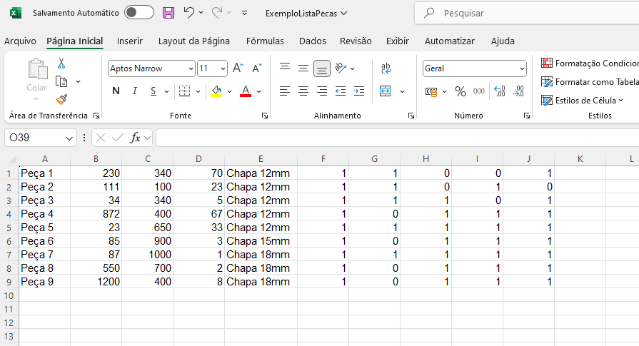
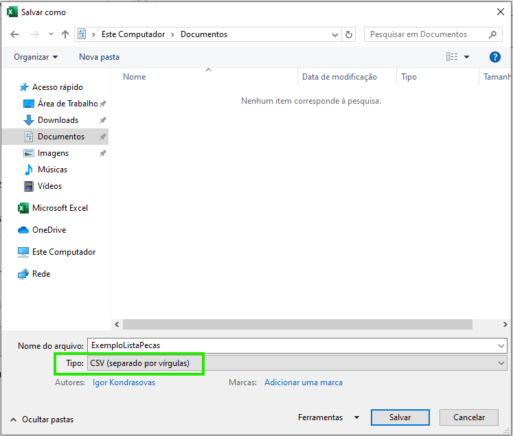
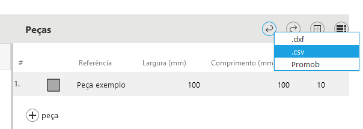
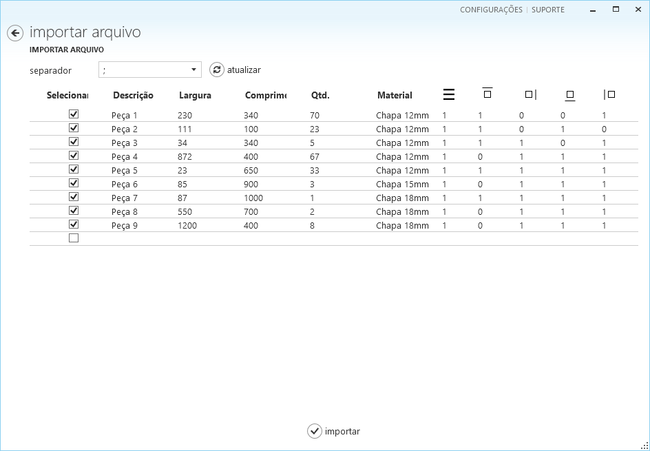
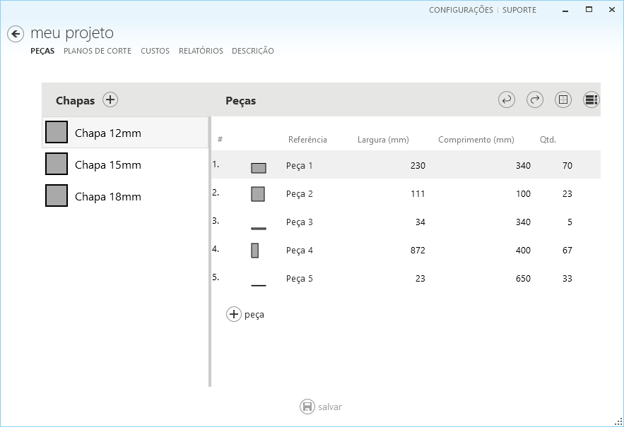
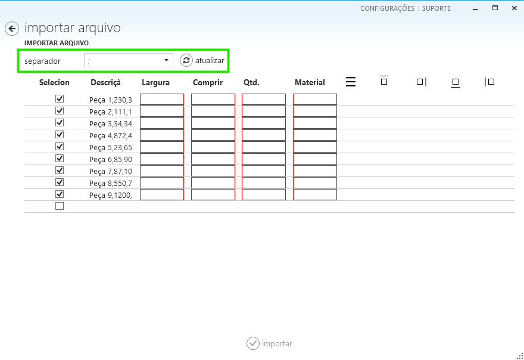
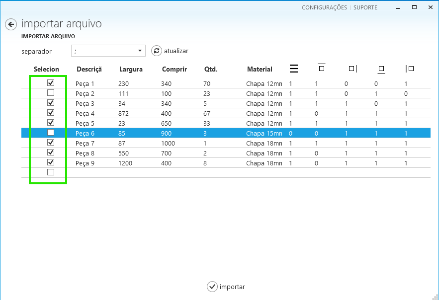

# Importar peças do Excel

O Otimize Nesting é, antes de tudo, um software de produtividade. Ele contém os recursos que você precisa para a criação de planos de corte com eficácia.

Se há um recurso comum a todos os aplicativos de produtividade, é a capacidade de ler dados de planilhas. Essas planilhas geralmente são criadas manualmente, por exemplo, no Microsoft Excel, ou automaticamente por outros programas.

Este guia ajuda você a poupar tempo, fazendo a importação de uma lista de peças retangulares.

> [!Note]
> Software para projetos (CAD) ou alguns sistema de gestão (ERP) podem gerar arquivos digitais com listas de peças para facilitar a integração entre sistemas. Estes arquivos podem ser usados no Otimize Nesting, se estiverem na formatação correta.

A importação da sua lista de peças para o Otimize Nesting envolve duas etapas principais: preparar o arquivo com as informações e depois importar este arquivo utilizando o Otimize Nesting.

## Parte 1: Preparar o arquivo com a lista de peças

Prepare uma planilha contendo a lista de peças que deseja produzir. O Otimize Nesting necessita que a planilha tenha um sequência de colunas. A imagem a seguir mostra um exemplo desta planilha.

As colunas da planilha são as seguintes:

**Descrição**: Essa é a primeira coluna da planilha, que contém a descrição da peça que será produzida. O plano de corte vai posteriormente exibir esta informação sobre cada peça.

**Largura**: Largura da peça a ser produzida. A unidade de comprimento (milímetros, centímetros, polegadas) deve corresponder à que você especificou na configuração do software.

**Comprimento**: Comprimento da peça a ser produzida. A unidade de comprimento (milímetros, centímetros, polegadas) deve corresponder à que você especificou na configuração do software.

**Quantidade**: Número de peças idênticas que serão produzidas.

**Material**: Nome do material ou chapa que será utilizada para produzir a peça. Durante a importação, o Otimize Nesting verifica se esse material já está no cadastro de materiais. Caso contrário, será adicionado um novo registro com o tamanho de chapa padrão.

> [!Note]
> Se o material já estiver no cadastro, suas configurações não serão atulizadas. Confira se as dimensões da chapa e a opção de veio estão corretas após concluir a importação.

> [!Note]
> O tamanho de chapa padrão é o tamanho que foi informado pelo utilizador na criação do último registro de material. É possível modificar este valor após a importação.

**Veio Direcional**: Indica se este material tem um acabamento ou veio especial onde as peças são cortadas de forma a respeitar a direção do veio para garantir uma aparência consistente em todas as peças. Esta opção é particularmente importante para projetos onde a estética é crucial, como móveis ou marcenaria. Se esta coluna contiver "0", o otimizador de corte terá mais flexibilidade para encontrar layouts de corte ideais.

**Fita de borda**: As últimas quatro colunas indicam qual lado da peça receberá o material de acabamento (fita de borda) ou necessitam de uma operação especial. A sequência destes lados é a seguinte:

- Superior
- Direito
- Inferior
- Esquerda

Quando todos os dados forem adicionados à planilha, salve-a em um arquivo no seu computador. Você deve salvar esse arquivo no formato CSV (Comma Separated Values, valores separados por vírgula):

1. Vá para a planilha no Microsoft Excel e selecione **Arquivo** -> **Salvar como**.
2. Será exibida uma caixa de diálogo. Selecione a pasta desejada, digite o nome do arquivo e selecione o tipo **CSV (separado por vírgulas)**.

Como alternativa, [faça o download deste exemplo de arquivo .csv](./importar-excel/ExemploListaPecas.csv) com a formatação correta das colunas e use-o como modelo para suas listas de peças.

## Parte 2: Importar o arquivo

1. Inicie o Otimize Nesting.
2. Crie um projeto e escolha o material. Ou então abra um projeto existente. Vá para a aba **Peças**.
3. Selecione **Importar peças** -> **csv**.

4. A caixa de diálogo **Abrir** arquivo é exibida. Localize e selecione o arquivo .csv que você salvou anteriormente. Selecione **Abrir**.
5. A página **Importar arquivo** é exibida com a lista de peças.

6. Selecione **Importar**. As peças serão adicionadas ao projeto, e a aba **Peças** será exibida novamente.

## Solução de problemas

### Configurações regionais

Idiomas e regiões diferentes podem usar caracteres de separação de colunas diferentes para planilhas. Se houver erros na página **Importar arquivo**:

1. Selecione o separador correto
2. Selecione **Atualizar** para ajudar a importação novamente

### Linha com Cabeçalhos

As planilhas podem ter na primeira linha os nomes das colunas. Essa ou qualquer outra linha pode ser ignorada para evitar erros na importação.

