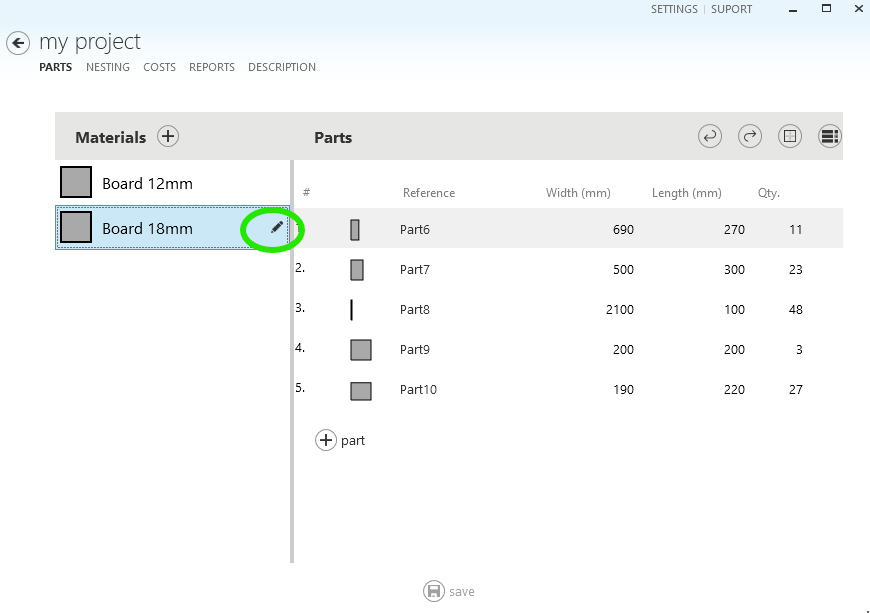
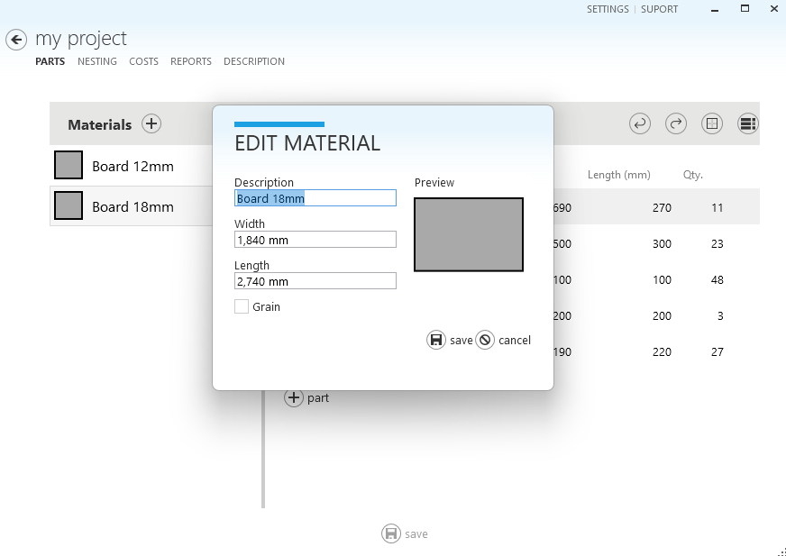

# Edit Material

To edit the material from the parts page:

1 - Select the material you want to edit and click on the icon that appears next to the name, as shown in the following image:

2 - The material editing window will be displayed. In it, you can change the description of the material, the width, and the length and indicate if the material has a vein, as shown in the following image

3 - Click on **Save** to confirm the changes.

4 - To have the cutting layouts recalculated with the new dimensions of the material, click on the **Nesting** tab and select **make nesting**.
