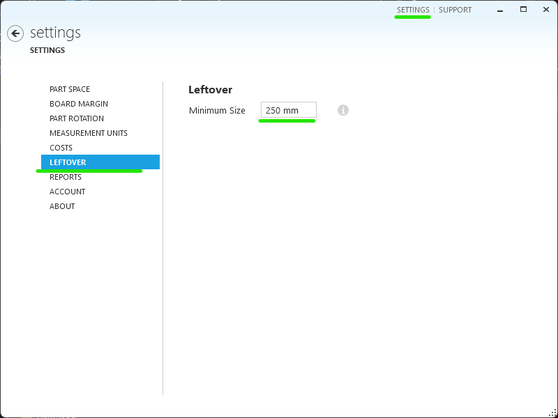

# Minimal Leftover Setting

The minimal leftover value allows you to know which remnants of material are useful for future use and which are considered scrap. By setting this value, you can see the optimization results separated by scraps and leftovers.

## How to Define Minimal Leftover Value

1. Open the *setting* dialog in Otimize Nesting.
2. Select *leftover* option.
3. Enter the desired minimal leftover size.

In the example above, any remnant smaller (width or length) than 250 mm will be automatically classified as scrap. Remnants equal to or larger than the minimal leftover value will be considered reusable.

## How the minimal leftover influences adhesive label generation

Otimize generates adhesive labels for parts and reusable leftovers. Scraps do not have labels, ensuring that only usable pieces are labeled for future use.