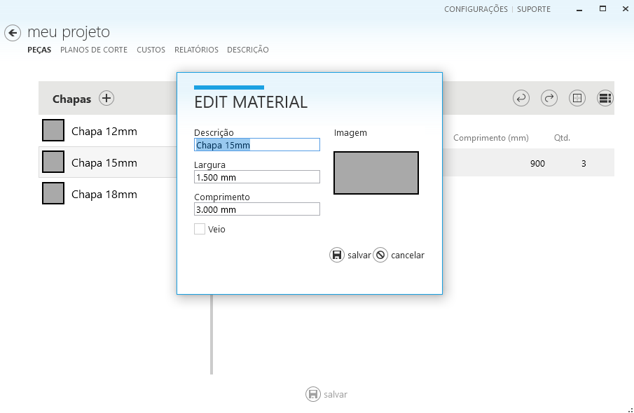

# Editar Material

Para editar o material a partir da página de peças:

1 - Selecione o material que deseja editar e clique no ícone que aparece ao lado do nome, conforme a imagem a seguir:

2 - A janela de edição do material será exibida. Nela, você pode alterar a descrição do material, a largura, o comprimento e indicar se o material possui veio, conforme a imagem a seguir

3 - Clique em **Salvar** para confirmar as alterações.

4 - Para que os planos de corte sejam recalculados com as novas dimensões do material, clique na aba **Planos de Corte** e selecione **Fazer o Nesting**.