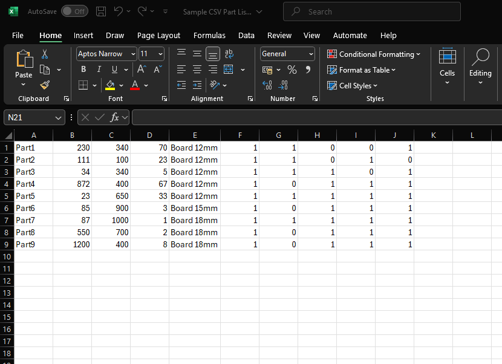
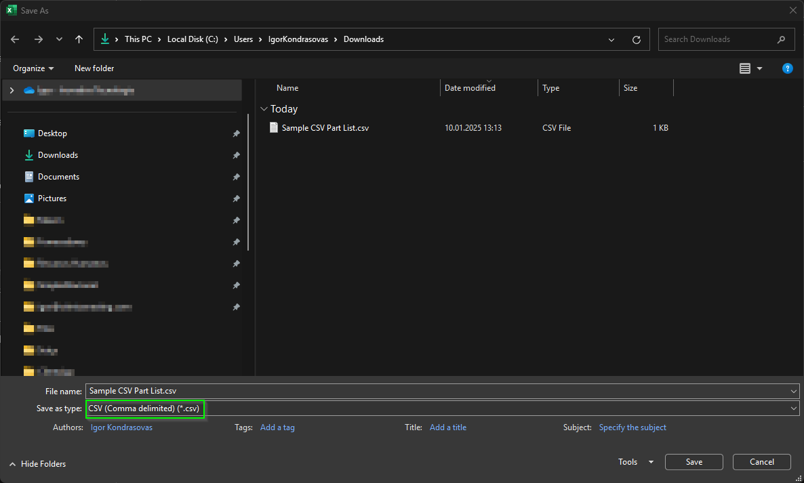
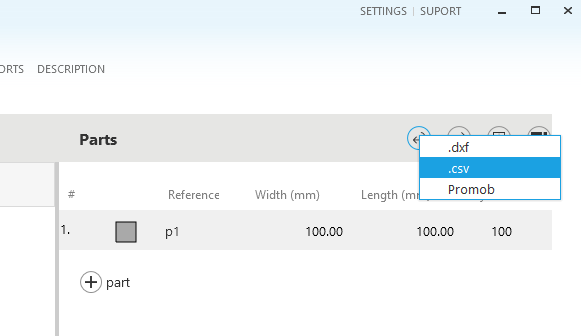
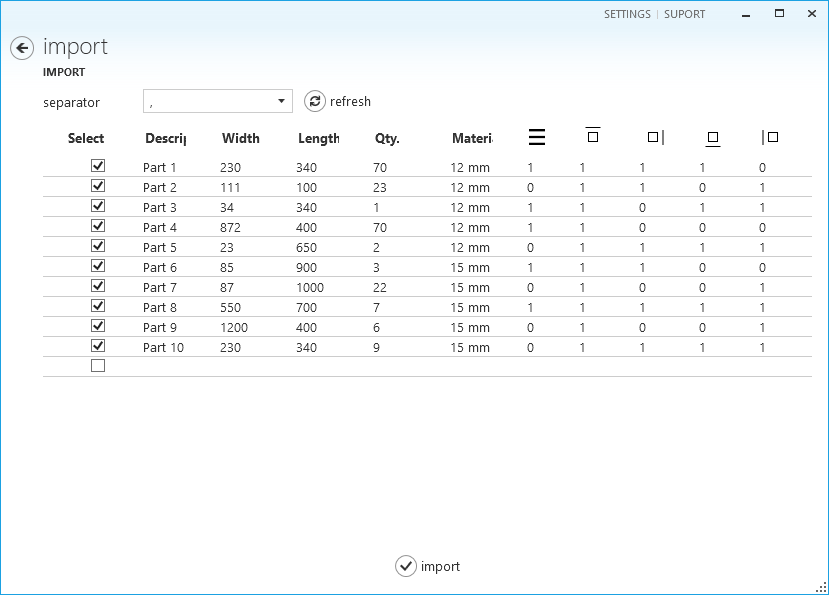
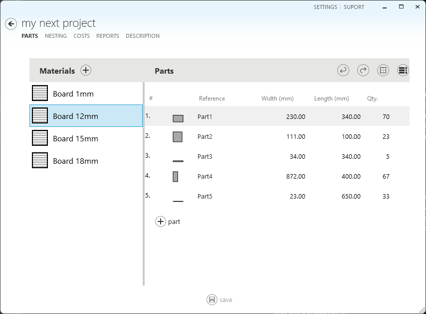
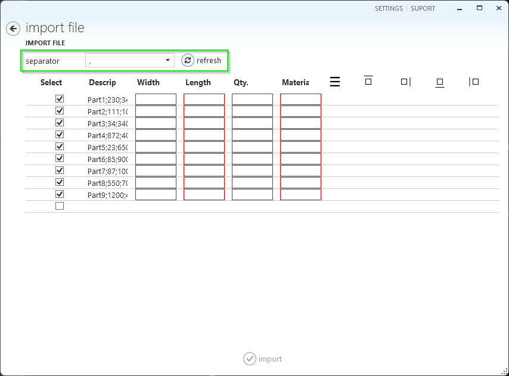
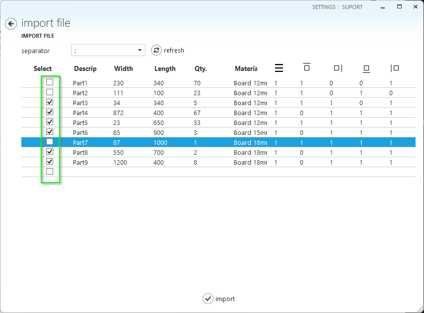

# Importing a Part List from Excel
Otimize Nesting is a productivity software tool, first and foremost. It includes the features you need for highly productive part nesting creation.

If there is a feature common to all productivity applications, it is the ability to read data from Excel spreadsheets. These spreadsheets are usually manually created, for example, in Microsoft Excel, or automatically created by another software program.

This topic covers the basics of importing rectangular part lists and helps you save time.

> [!NOTE]
> Special CAD or ERP systems can create digital files with part lists to improve system integration. If these files have the correct column configuration, they can be imported into Otimize Nesting.

There are two main steps to importing your existing part list into Otimize Nesting. The first step is to prepare the file, and the second part is to import the file using Otimize Nesting.

## Part 1: Prepare the Part List File
Prepare a spreadsheet containing the list of parts you want to produce. Otimize Nesting expects a given spreadsheet column position for each part information. The following image shows a sample part list.

The columns are as follows:

**Description**: This is the first column of the file, and it contains the textual description of the part that must be produced. This text will be available on the nesting diagrams over the part's area.

**Width**: Represents the width of the part to be produced. The length unit (millimeters, centimeters, inches) must match the one you selected in the software configuration.

**Length**: The same applies to the width column here.

**Quantity**: Represents the number of identical parts that will be produced.

**Material**: This represents the name of the raw material this part will be produced from. During import, Otimize Nesting checks if this material already exists on the material list. If not, a new material record will be created with a default board size added.

**Rotate/Grain**: If the column contains **1** (recommended for most scenarios), this part can be rotated in steps of 90 degrees so the optimizer can find a better layout.

This option should be set to **1** unless the parts you produce come from a material with grain or vein. If so, we recommend leaving this column value equal to **0**.

**Edge Band**: The last four columns indicate which side of the part will receive finishing material. In the case of furniture, for example, these indicate what sides of the part will receive an edge band. The order of these edge band sides is as follows:

- Top
- Right
- Bottom
- Left

When all the data is added to the spreadsheet, please save it to a file on your local computer.

You must save this file in CSV (Comma Separated Values) format:

1.	Go to your spreadsheet in Microsoft Excel and select **File** -> **Save As**.
2.	A dialog is shown. Select the desired folder, enter the file name, and make sure to select **CSV (Comma delimited) (*.csv)** save as type.

Alternatively, [download this sample .csv file](./import-excel/SampleCSVPartList.csv) with the correct column formatting and use it as a model for your part lists.

## Part 2: Import the Part List File

1.	Start Otimize Nesting.
2.	Create a new or open an existing project. Go to the **Parts** tab.
3.	Select **Import Parts** -> **csv**.

4.	The **Open** file dialog is displayed. Find and select the .csv file you saved before. Select **Open**.
5.	The **Import File** page is displayed with the part list.

6.	Select **Import**. The parts will be added to the project, and the Part tab will be displayed again.

## Troubleshooting

### Regional Settings

Different languages and regions may use different column separation characters for spreadsheets. If you experience errors in the **Import File** page:
1.	Select the correct separator
2.	Select **Refresh** to have the data updated

### Row Headers

Typically, spreadsheets contain header column names on the first row. This or any other row can be ignored on the **Import File** page.

